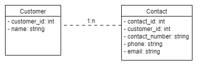
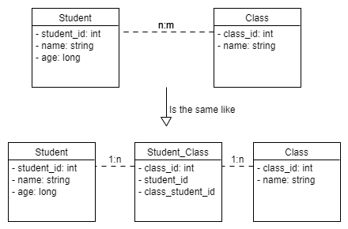

# ORMapper

## SWE3_Project to design an OR Mapper

## Used languages:

* Java
* Postgres

## Functionality:

* A Good ORM can lead to much less code and much less repetition in a project
* Allows the changes in Database technologies
* Queries should be generated by the mapper without even thinking about Dialect or how the transaction is happening.
* This Design is simplified to approach a simple application of OR Mapper using Java, Postgres Container in Docker
* Database tables are already present, and the Mapper enables the queries on these tables
* The mapper is designed Code first style following these steps:
    * Configuring the connection with the Database as settings in persistence layer
    * Adding the classes as tables and the properties as columns in Entity layer
    * Adding different functions 'Select, delete, insert, update, drop' in Services layer
    * Adding transactions services 'join, find' in Service layer
    * Model layer is used to show a demo of the ORMapper and uses annotations
    * Annotations layer to define the reflection function that will define the tables and the columns

## Data Model:

This ORM supports tables that has foreign keys to refer to other tables and connect to them. as an example for 1-n
relationship:



as an example for n-m relationship:



SQL Script could be like the following:

```
create table if not exists test
(
	id bigserial
		constraint test_pk
			primary key,
	"testName" varchar
);

alter table test owner to postgres;

create table if not exists customers
(
	customer_id integer generated always as identity
		constraint customers_pkey
			primary key,
	customer_name varchar(255) not null
);

alter table customers owner to postgres;

create table if not exists contacts
(
	contact_id integer generated always as identity
		constraint contacts_pkey
			primary key,
	customer_id integer
		constraint fk_customer
			references customers,
	contact_name varchar(255) not null,
	phone varchar(15),
	email varchar(100)
);

alter table contacts owner to postgres;
```

The most important thing is to choose Primary key as serial that increments automatically.

## Manual:

The following steps explain how to use this ORM :

1. Create a Postgres Database Docker Container. It could be #something like this:
```
   $ docker run --name Database -p 5432:5432 -e POSTGRES_PASSWORD=if19b166 -d postgres
```
2. Adding url, username, password to Config.xml in Settings folder.
3. Create a new ORM object where it is needed.
4. Create classes as entities with annotations to connect to the tables in DB
```
> <p>@table -----------> for a class</p> 
> <p>@Column ----------> for a property with the name of the column</p>
> <p>@PrimaryKey-------> for unique ids</p>
> <p>@ForeignKey-------> for foreign ids with the entity related to it for safe choice </p>
```
5. ORM can make the calls to our database and save them in lists of objects and cashed the values after first call.
6. The following functions can be used to fulfill the needs of this ORM:

<table>
  <tr>
    <th>Function</th>
    <th>Requires</th>
    <th>Returns</th>
  </tr>
  <tr>
    <td><strong>setCash</strong></td>
    <td>boolean to allow the cash</td>
    <td> It is void Method to set the cash </td>
  </tr>
  <tr>
    <td><strong>CreateTable</strong></td>
    <td>Class Entity that is created by the user with proper annotations</td>
    <td> Void method creates a table in postgres Container</td>
  </tr>
  <tr>
    <td><strong>DropTable</strong></td>
    <td>Class Entity that is created by the user with proper annotations</td>
    <td> Void method drops a table in postgres Container</td>
  </tr>
  <tr>
    <td><strong>SelectAllRows</strong></td>
    <td>Class Entity that is created by the user with proper annotations</td>
    <td>returns list of all objects of this class</td>
  </tr>
<tr>
    <td><strong>SelectAllColumns</strong></td>
    <td>Class Entity that is created by the user with proper annotations</td>
    <td> return list of Strings of columns names of the table mapped to the class</td>
  </tr>
<tr>
    <td><strong>SelectByID</strong></td>
    <td>Class Entity with the id of the Primary key</td>
    <td> returns an object of the class responding to this ID</td>
  </tr>
<tr>
    <td><strong>SelectByColumn</strong></td>
    <td>Class Entity and the column and its value </td>
    <td> returns list of objects that match the column value</td>
  </tr>
<tr>
    <td><strong>Argument</strong></td>
    <td> create a neu argument with column name , value and operator</td>
    <td> new argument to be used in the query</td>
  </tr>
<tr>
    <td><strong>SelectMultiArgQuery</strong></td>
    <td>Class Entity , where operator (AND or OR), List of Arguments </td>
    <td>List of Objects that match the required logic</td>
  </tr>
<tr>
    <td><strong>SelectOneArgQuery</strong></td>
    <td>Class Entity and the argument</td>
    <td>List of Objects that match the required logic</td>
  </tr>
<tr>
    <td><strong>JoinbyForiegnKey</strong></td>
    <td>1-n relation with the class entities and the id that matches the PK in one class with FK in the other one</td>
    <td>Map of One Object and list of Objects related to it </td>
  </tr>
<tr>
    <td><strong>JoinAll</strong></td>
    <td>1-n relation with the class entities at any ID</td>
    <td> Map of Objects and list of Objects related to them</td>
  </tr>
<tr>
    <td><strong>Insert</strong></td>
    <td>New Object of the entity</td>
    <td>returns new ID and updates the Object after saving</td>
  </tr>
<tr>
    <td><strong>UpdatebyID</strong></td>
    <td>New Object and the ID</td>
    <td>Void Method updates the row</td>
  </tr>
<tr>
    <td><strong>DeleteRowbyId</strong></td>
    <td>Object and the ID</td>
    <td>Delete the row by the ID</td>
  </tr>
</table>

  